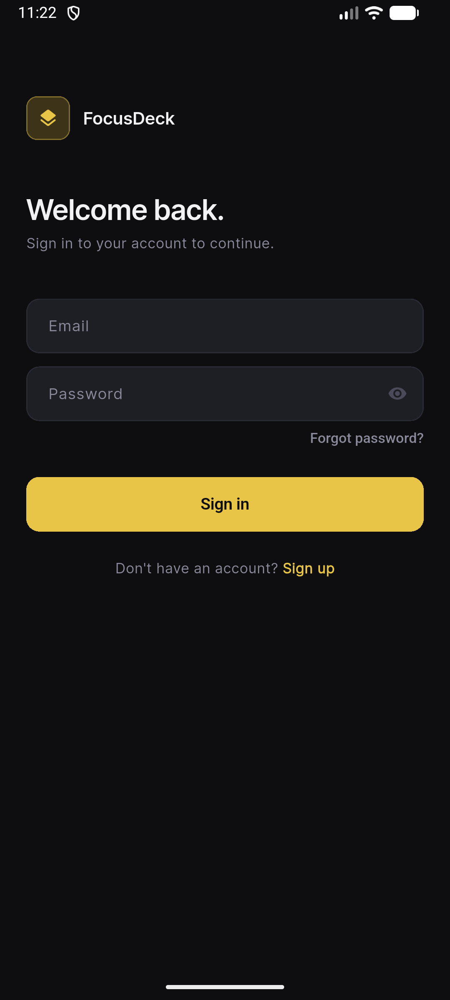
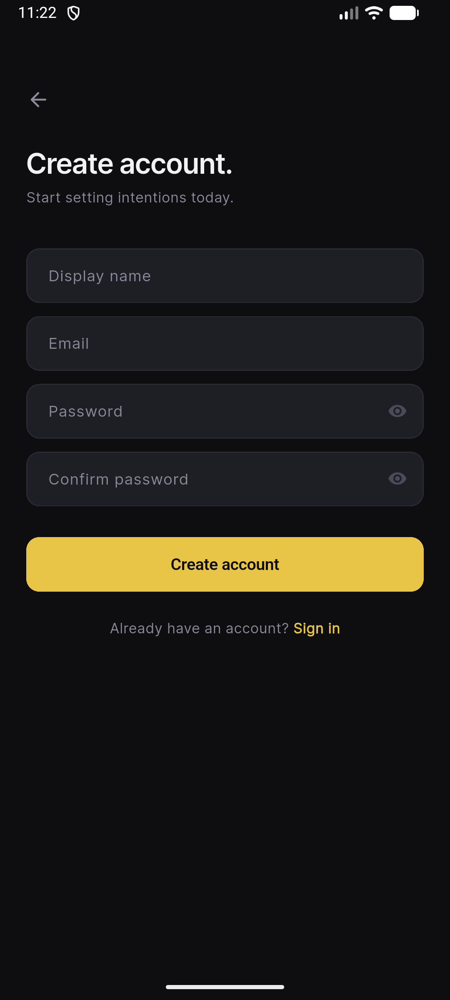
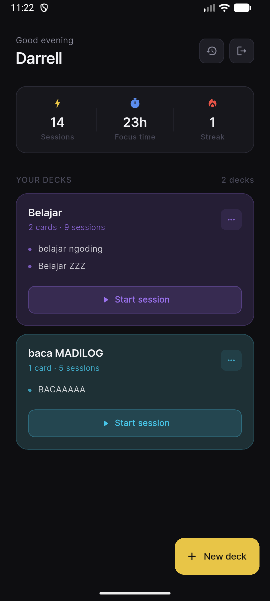
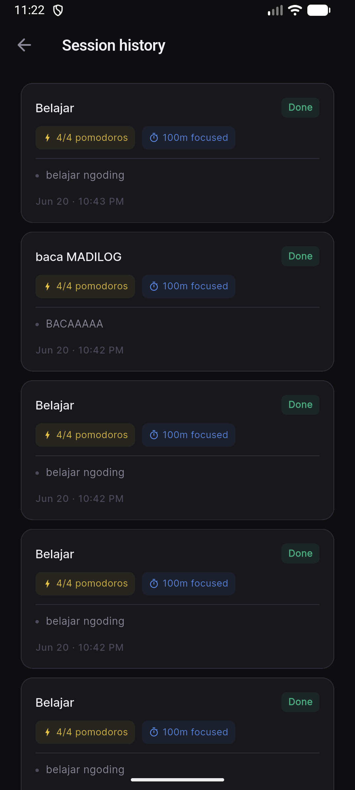
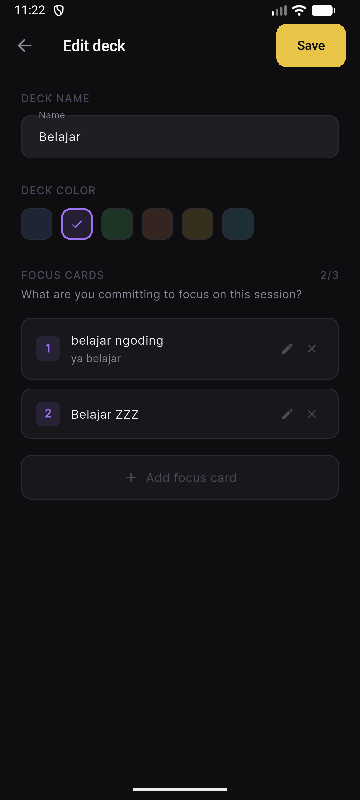
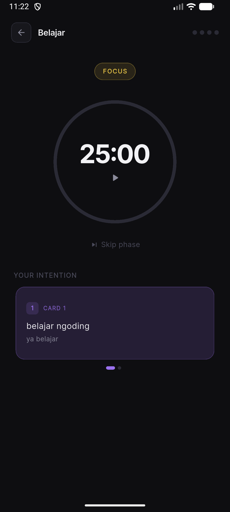
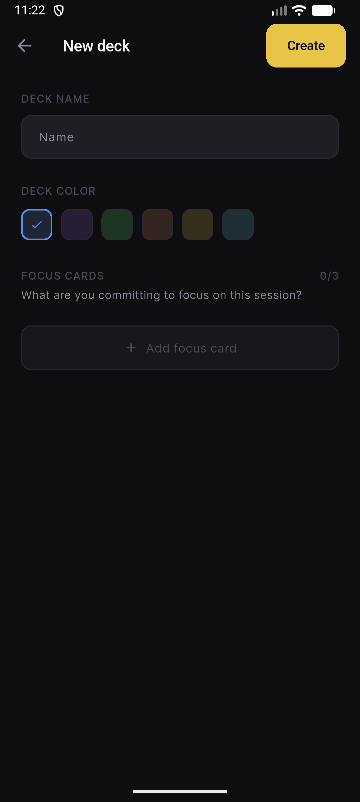

# FocusDeck

Aplikasi produktivitas berbasis Pomodoro timer dengan konsep "kartu fokus" — sebelum memulai sesi kerja, pengguna menuliskan niat/tugas yang ingin dikerjakan dalam bentuk kartu, lalu kartu itu tetap terlihat selama timer berjalan sebagai pengingat fokus.

Dibangun dengan **Flutter** (frontend) dan **Firebase** (backend: Authentication + Firestore).

---

## Daftar Isi

- [Apa Itu FocusDeck](#apa-itu-focusdeck)
- [Fitur](#fitur)
- [Tech Stack & Dependensi](#tech-stack--dependensi)
- [Struktur Proyek](#struktur-proyek)
- [Informasi Backend](#informasi-backend)
- [Cara Menjalankan Aplikasi](#cara-menjalankan-aplikasi)
- [Skema Data Firestore](#skema-data-firestore)
- [Keamanan](#keamanan)
- [Screenshot](#screenshot)

---

## Apa Itu FocusDeck

Alur penggunaannya sederhana:

1. Buat **deck** (misalnya "Belajar Sore" atau "Ngerjain Skripsi")
2. Isi deck dengan 1–3 **kartu fokus** — tugas spesifik yang ingin dikerjakan di sesi itu
3. Mulai sesi — timer Pomodoro (25 menit fokus, 5 menit istirahat, 15 menit istirahat panjang tiap 4 sesi) berjalan sambil kartu fokus tetap tampil
4. Setiap sesi yang selesai otomatis tersimpan ke Firestore, lengkap dengan statistik (jumlah sesi, total waktu fokus, streak harian)

Tidak ada fitur AI atau API berbayar — seluruh logic timer berjalan murni di Dart, dan satu-satunya layanan eksternal adalah Firebase (Authentication + Firestore), yang gratis pada tier Spark.

---

## Fitur

- **Autentikasi pengguna** — Daftar dan masuk dengan email & password lewat Firebase Authentication. Sesi login tersimpan otomatis (tidak perlu login ulang tiap buka aplikasi).
- **Deck builder** — Membuat, mengedit, dan menghapus deck. Setiap deck punya warna penanda dan maksimal 3 kartu fokus (judul + catatan opsional).
- **Pomodoro timer** — Timer interaktif dengan tap-to-start/pause, tombol skip antar fase, dan indikator progress melingkar.
- **Pelacakan sesi** — Setiap sesi (selesai penuh maupun dihentikan di tengah jalan) tersimpan ke Firestore dengan jumlah pomodoro, total menit fokus, dan kartu yang dikerjakan.
- **Statistik & streak** — Dashboard menampilkan total sesi, total waktu fokus, dan streak harian (bertambah jika menyelesaikan sesi pada hari berturut-turut, reset jika ada hari yang terlewat).
- **Riwayat sesi** — Daftar lengkap sesi yang pernah dijalankan, lengkap dengan status dan waktu.
- **UI gelap dengan animasi halus** — Tema dark khusus, kartu deck berwarna-warni, transisi dan micro-interaction di seluruh aplikasi.

---

## Tech Stack & Dependensi

| Layer | Teknologi |
|---|---|
| Framework UI | Flutter (Dart) |
| State Management | Riverpod 2.x |
| Navigasi | GoRouter 13.x |
| Backend | Firebase Authentication + Cloud Firestore |
| Animasi | flutter_animate |
| Font | Google Fonts (Inter) |
| Timer | Dart `Timer.periodic` dibungkus `StateNotifier` |

Dependensi utama (lihat `pubspec.yaml` untuk versi pasti):

```yaml
flutter_riverpod: ^2.6.1
go_router: ^13.2.5
firebase_core: ^2.32.0
firebase_auth: ^4.20.0
cloud_firestore: ^4.17.5
flutter_animate: ^4.5.0
google_fonts: ^6.3.3
percent_indicator: ^4.2.3
flutter_secure_storage: ^9.2.4
uuid: ^4.3.3
intl: ^0.19.0
```

---

## Struktur Proyek

Proyek mengikuti pendekatan **feature-based clean architecture**: setiap fitur punya folder sendiri yang memisahkan data (model), providers (logic/state), dan presentation (UI).

```
lib/
├── main.dart                       # Entry point, inisialisasi Firebase
├── firebase_options.dart           # Konfigurasi Firebase (generated, tidak di-commit ke repo publik)
│
├── core/                           # Kode yang dipakai lintas fitur
│   ├── constants/
│   │   └── app_constants.dart      # Konstanta aplikasi (durasi pomodoro, limit kartu, dll)
│   ├── theme/
│   │   └── app_theme.dart          # Warna, tipografi, ThemeData
│   ├── utils/
│   │   └── router.dart             # Konfigurasi GoRouter + auth guard
│   └── widgets/
│       ├── app_button.dart         # Komponen tombol reusable
│       └── app_text_field.dart     # Komponen input reusable
│
└── features/
    ├── auth/                       # Login, register, status autentikasi
    │   ├── providers/
    │   │   └── auth_provider.dart  # AuthService (Firebase Auth) + stream status login
    │   └── presentation/pages/
    │       ├── splash_page.dart
    │       ├── login_page.dart
    │       └── register_page.dart
    │
    ├── home/                       # Dashboard utama
    │   └── presentation/
    │       ├── pages/home_page.dart
    │       └── widgets/
    │           ├── deck_card_widget.dart
    │           ├── stats_row_widget.dart
    │           └── empty_state_widget.dart
    │
    ├── deck/                       # CRUD deck & kartu fokus
    │   ├── data/
    │   │   └── deck_model.dart     # Model Deck & FocusCard
    │   ├── providers/
    │   │   └── deck_provider.dart  # DeckService (operasi Firestore)
    │   └── presentation/pages/
    │       └── deck_builder_page.dart
    │
    ├── session/                    # Logic timer Pomodoro & penyimpanan sesi
    │   ├── data/
    │   │   └── session_model.dart  # Model Session
    │   ├── providers/
    │   │   └── session_provider.dart  # PomodoroNotifier + SessionService + logic streak
    │   └── presentation/pages/
    │       └── session_page.dart
    │
    └── history/                    # Riwayat sesi
        └── presentation/pages/
            └── history_page.dart
```

Pemisahan ini membuat logic bisnis (providers) tidak bercampur dengan kode UI (presentation), dan setiap fitur bisa dikembangkan/diuji secara independen.

---

## Informasi Backend

Backend aplikasi ini sepenuhnya menggunakan **Firebase** (Backend-as-a-Service), bukan server custom:

- **Firebase Authentication** — menangani pendaftaran, login, dan manajemen sesi pengguna dengan email/password.
- **Cloud Firestore** — database NoSQL real-time, menyimpan data pengguna, deck, dan riwayat sesi. Aplikasi menggunakan `StreamProvider` (Riverpod) yang terhubung langsung ke Firestore snapshots, sehingga perubahan data ter-update otomatis ke UI tanpa perlu refresh manual.

Tidak ada REST API custom karena seluruh komunikasi data terjadi langsung antara Flutter SDK dan Firebase melalui Firebase SDK resmi (`firebase_auth`, `cloud_firestore`).

### Koleksi Firestore yang digunakan

| Koleksi | Fungsi |
|---|---|
| `users` | Profil pengguna + statistik agregat (total sesi, total menit fokus, streak) |
| `decks` | Deck milik tiap pengguna beserta kartu fokus di dalamnya |
| `sessions` | Riwayat tiap sesi Pomodoro yang dijalankan |

Detail skema lengkap ada di bagian [Skema Data Firestore](#skema-data-firestore).

---

## Cara Menjalankan Aplikasi

### Prasyarat

- Flutter SDK 3.x — [panduan instalasi](https://flutter.dev/docs/get-started/install)
- Akun Firebase (gratis, tier Spark sudah cukup)
- Untuk Android: Android Studio / Android SDK
- Untuk iOS: Mac + Xcode 15+

### 1. Clone repository

```bash
git clone <url-repo-hasil-fork-kamu>
cd focusdeck
```

### 2. Pasang dependensi

```bash
flutter pub get
```

### 3. Hubungkan ke project Firebase milikmu sendiri

Aplikasi ini **tidak menyertakan kredensial Firebase** (file `firebase_options.dart`, `google-services.json`, dan `GoogleService-Info.plist` sengaja tidak di-commit demi keamanan — lihat bagian [Keamanan](#keamanan)). Untuk menjalankan aplikasi, buat project Firebase sendiri:

1. Buka [console.firebase.google.com](https://console.firebase.google.com) → buat project baru
2. Aktifkan **Authentication** → sign-in method **Email/Password**
3. Buat **Firestore Database** (pilih region terdekat, mis. `asia-southeast1`)
4. Terapkan security rules dari bagian [Keamanan](#keamanan) di bawah
5. Install FlutterFire CLI dan hubungkan project:

```bash
dart pub global activate flutterfire_cli
flutterfire configure
```

Pilih project Firebase yang baru dibuat, lalu pilih platform **android** dan **ios**. Perintah ini otomatis men-generate `lib/firebase_options.dart`.

### 4. Buat index Firestore

Buka **Firestore → Indexes → Composite**, buat dua index berikut (atau biarkan Firestore memberi link otomatis saat query pertama kali gagal karena index belum ada):

| Collection | Field 1 | Field 2 |
|---|---|---|
| `decks` | `uid` (Ascending) | `updatedAt` (Descending) |
| `sessions` | `uid` (Ascending) | `startedAt` (Descending) |

### 5. Jalankan di Android

```bash
flutter run
```

### 6. Jalankan di iOS (via Xcode)

```bash
cd ios
pod install
cd ..
flutter run -d ios
```

Sebelum run, buka `ios/Runner.xcworkspace` di Xcode lalu:
- Ganti **Bundle Identifier** sesuai keinginan (mis. `com.namamu.focusdeck`)
- Pilih **Apple Developer Team** di tab Signing & Capabilities
- Pastikan `GoogleService-Info.plist` (hasil dari `flutterfire configure`) sudah masuk ke target Runner

---

## Skema Data Firestore

### `users/{uid}`

```json
{
  "uid": "string",
  "email": "string",
  "displayName": "string",
  "createdAt": "timestamp",
  "totalSessions": "number",
  "totalFocusMinutes": "number",
  "currentStreak": "number",
  "lastSessionDate": "timestamp | null"
}
```

### `decks/{deckId}`

```json
{
  "id": "string",
  "uid": "string",
  "title": "string",
  "cards": [
    { "id": "string", "title": "string", "note": "string | null" }
  ],
  "colorIndex": "number (0-5)",
  "createdAt": "timestamp",
  "updatedAt": "timestamp",
  "sessionCount": "number"
}
```

### `sessions/{sessionId}`

```json
{
  "id": "string",
  "uid": "string",
  "deckId": "string",
  "deckTitle": "string",
  "cardTitles": ["string"],
  "plannedPomodoros": "number",
  "completedPomodoros": "number",
  "focusMinutes": "number",
  "status": "completed | abandoned",
  "startedAt": "timestamp",
  "endedAt": "timestamp | null"
}
```

---

## Keamanan

Beberapa langkah yang diterapkan supaya aplikasi ini tidak meninggalkan celah keamanan yang umum ditemukan di proyek tugas kuliah:

**1. Tidak ada kredensial yang ikut ter-commit ke repository.**
File-file berikut sengaja dimasukkan ke `.gitignore` dan tidak ada di riwayat commit:
- `lib/firebase_options.dart`
- `android/app/google-services.json`
- `ios/Runner/GoogleService-Info.plist`

Setiap orang yang menjalankan proyek ini wajib menghubungkan ke project Firebase miliknya sendiri lewat `flutterfire configure` (lihat langkah di atas). Ini mencegah API key dan project ID Firebase tersebar publik di GitHub.

> Catatan: API key Firebase pada dasarnya tidak bersifat rahasia mutlak seperti API key layanan lain (Firebase didesain agar API key boleh terlihat di client), tapi tetap dipisahkan dari repository sebagai praktik kebersihan kode dan supaya tiap penguji menjalankan dengan instance Firebase-nya sendiri tanpa konflik data.

**2. Firestore Security Rules membatasi akses per pengguna**, bukan dibiarkan dalam mode terbuka (test mode). Setiap dokumen hanya bisa dibaca/ditulis oleh pemilik data yang sesuai, diverifikasi lewat `request.auth.uid`:

```js
rules_version = '2';
service cloud.firestore {
  match /databases/{database}/documents {

    match /users/{userId} {
      allow read, write: if request.auth != null && request.auth.uid == userId;
    }

    match /decks/{deckId} {
      allow read, write: if request.auth != null && request.auth.uid == resource.data.uid;
      allow create: if request.auth != null && request.auth.uid == request.resource.data.uid;
    }

    match /sessions/{sessionId} {
      allow read, write: if request.auth != null && request.auth.uid == resource.data.uid;
      allow create: if request.auth != null && request.auth.uid == request.resource.data.uid;
    }
  }
}
```

Artinya: pengguna A tidak bisa membaca atau mengubah deck/sesi milik pengguna B, bahkan kalau ia tahu document ID-nya secara langsung — karena akses ditolak di level server (Firestore), bukan cuma disembunyikan di UI.

**3. Autentikasi wajib untuk semua operasi data.** Tidak ada koleksi yang bisa diakses tanpa login terlebih dahulu (`request.auth != null` dicek di setiap rule).

**4. Password tidak pernah disimpan atau ditangani langsung oleh aplikasi.** Seluruh proses hashing dan penyimpanan kredensial password ditangani oleh Firebase Authentication, bukan oleh kode aplikasi ini.

---

## Screenshot

Seluruh screenshot tersedia di folder [`SS_FocusDeck_Android`](./SS_FocusDeck_Android) dan [`SS_FocusDeck_iOS`](./SS_FocusDeck_iOS).

### Android

| | | |
|---|---|---|
|  |  |  |
|  |  |  |
|  | | |

### iOS

| | | |
|---|---|---|
|  |  |  |
|  |  |  |

---

*Dibangun dengan Flutter · Firebase · Riverpod*